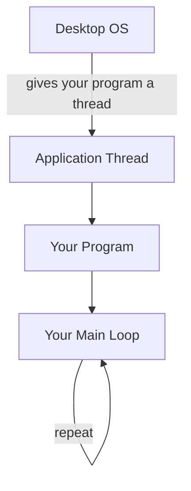
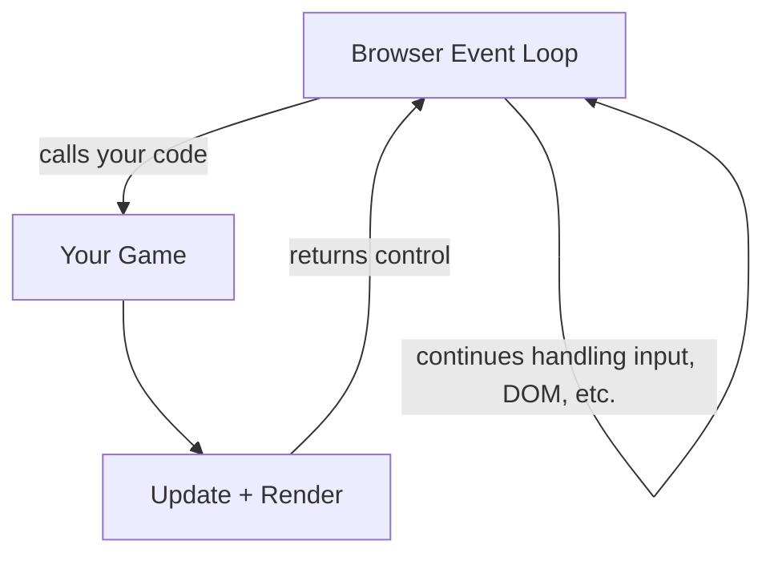
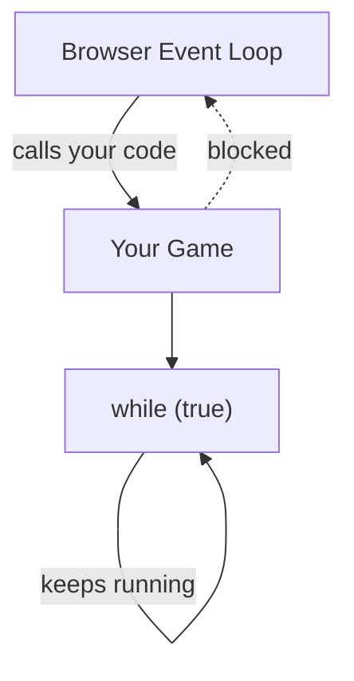
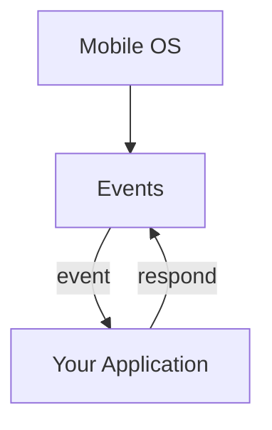
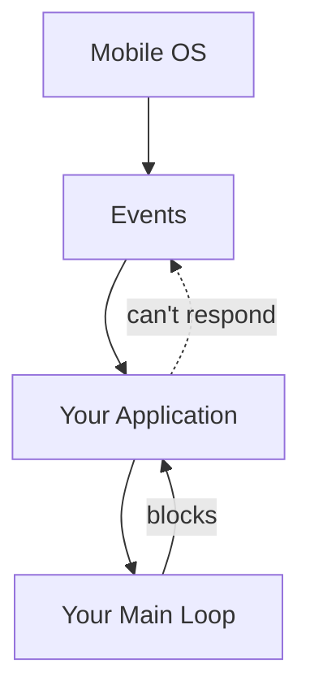
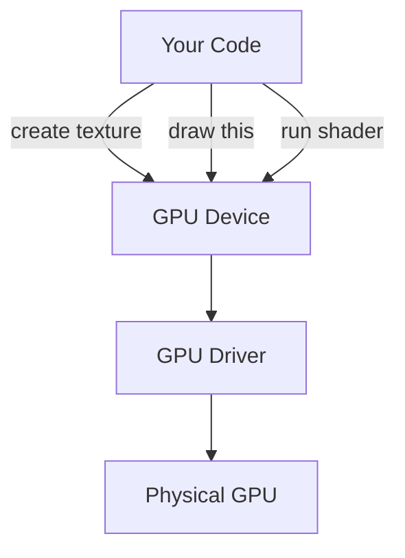
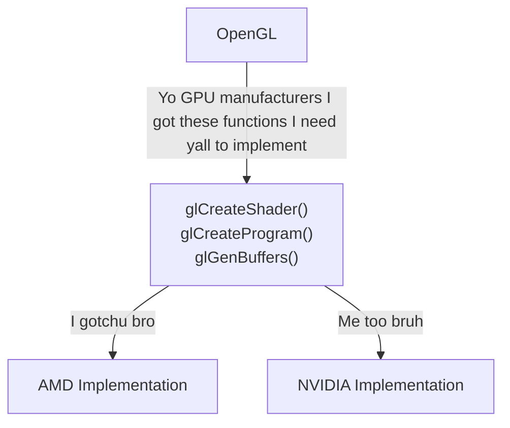
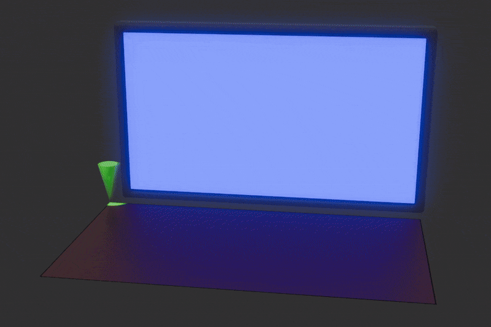
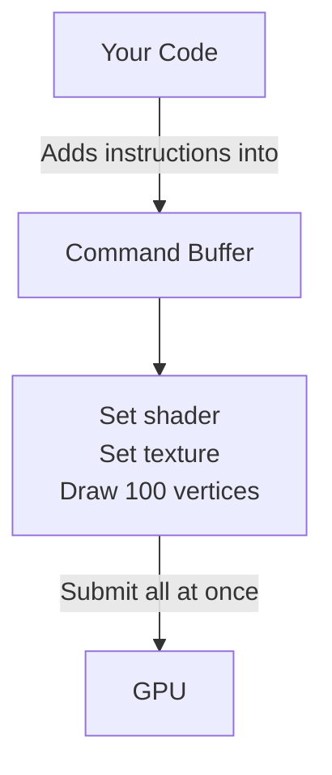

# Clearing the Screen

First things first, let us open a window, if you've worked with Raylib or SDL before, you may have constructed the main loop yourself such as:

```go
package src

import rl "vendor:raylib"

main :: proc() {
	rl.InitWindow(1280, 720, "My Window")
	rl.SetTargetFPS(60)
	for !rl.WindowShouldClose() {
		rl.BeginDrawing()
		rl.ClearBackground(rl.BLACK)
		rl.EndDrawing()
	}
	rl.CloseWindow()
}
```

This works fine on desktop OSes such as Windows, macOS and Linux. However, if you try to compile the same code for the web or mobile and then run the compiled program, the program will crash or freeze when you try to run it. Why is that?

On desktop platforms, your program is the boss, the OS gives your program a thread and your program takes complete control of it.

<div align="center">



</div>

On the web, the story is different. Javascript and the DOM (The system that draws the actual webpage) are single-threaded. Everything happening on a webpage must happen on that single thread like processing inputs and drawing graphics. However, if your program runs a main loop itself, the browser is "locked out" and can't check if the user clicked a webpage element or draw anything, so the entire tab you are on instantly freezes.

So below I have a diagram showing what you what happens if you don't block the web page with your own loop.
<div align="center">



</div>

Now if you put your own main loop:

<div align="center">



</div>

Thats a no-no we don't want to block the current web page with our main loop.

On mobile, the OS expects your program to listen for signals "You are starting up" or "You are being sent to the background because the user got a phone call." If you use a main loop in your program, the app stops listening to the signals given by the OS. After a while of the program not listening, the OS just terminates your program.

Lets see what happens if you don't block mobile with your own main loop:

<div align="center">



</div>

Now if you do block mobile with your own main loop:

<div align="center">



</div>

In short, while on desktop platforms you handle the main loop, on web and mobile, the browser/OS handles the main loop.

This is where SDL callbacks come in, by passing your code into functions like app_init, app_iterate, app_event, app_quit, SDL can use your functions and handle those platform differences for you (On desktop it constructs a main loop and calls those functions in the main loop. On mobile it calls those functions when the OS gives your program the corresponding signals), allowing you to easily port your code to variety of platforms.

Lets see how to do these "SDL callbacks."

```go
package src

import "base:runtime"
import "core:c"
import sdl "vendor:sdl3"

window: ^sdl.Window

main :: proc() {
	sdl.RunApp(0, nil, app_main, nil)
}

@(export)
app_main :: proc "c" (argc: c.int, argv: [^]cstring) -> c.int {
	return sdl.EnterAppMainCallbacks(argc, argv, app_init, app_iterate, app_event, app_quit)
}

@(export)
app_init :: proc "c" (appstate: ^rawptr, argc: c.int, argv: [^]cstring) -> sdl.AppResult {
	return .CONTINUE
}

@(export)
app_iterate :: proc "c" (appstate: rawptr) -> sdl.AppResult {
	return .CONTINUE
}

@(export)
app_event :: proc "c" (appstate: rawptr, event: ^sdl.Event) -> sdl.AppResult {
	return .CONTINUE
}

@(export)
app_quit :: proc "c" (appstate: rawptr, result: sdl.AppResult) {
	context = global_context
}
```

As you might realize this won't open a window by itself because there wasn't any code to explicitly create the window at all. So let us do that.

```go
package src

import "base:runtime"
import "core:c"
import sdl "vendor:sdl3"

WINDOW_WIDTH :: 1280
WINDOW_HEIGHT :: 720

global_context: runtime.Context

window: ^sdl.Window

main :: proc() {
	sdl.RunApp(0, nil, app_main, nil)
}

@(export)
app_main :: proc "c" (argc: c.int, argv: [^]cstring) -> c.int {
	context = global_context
	return sdl.EnterAppMainCallbacks(argc, argv, app_init, app_iterate, app_event, app_quit)
}

@(export)
app_init :: proc "c" (appstate: ^rawptr, argc: c.int, argv: [^]cstring) -> sdl.AppResult {
	context = global_context
	ok := sdl.Init({.VIDEO})
	assert(ok)

	window = sdl.CreateWindow("Handmade GPUer", WINDOW_WIDTH, WINDOW_HEIGHT, {})
	assert(window != nil)

	return .CONTINUE
}

@(export)
app_iterate :: proc "c" (appstate: rawptr) -> sdl.AppResult {
	context = global_context
	return .CONTINUE
}

@(export)
app_event :: proc "c" (appstate: rawptr, event: ^sdl.Event) -> sdl.AppResult {
	context = global_context
	#partial switch event.type {
	case .QUIT:
		return .SUCCESS
	}
	return .CONTINUE
}

@(export)
app_quit :: proc "c" (appstate: rawptr, result: sdl.AppResult) {
	context = global_context
	sdl.DestroyWindow(window)
	sdl.Quit()
}
```

Now if you ran the code above, you might be thinking I was a liar, the code above doesn't actually work at all and you are seeing no window at all. Well, that is actually to be expected because there is nothing to "present," we haven't drawn anything yet. So, lets clear the background. However before then lets learn a few concepts.

## GPU Device

The GPU device is the software representation of the actual GPU(s) on your computer, SDL provides this interface so you can send the GPU commands to do stuff like clearing the screen or drawing textures.

<div align = "center">

</div>

## GPU Driver

Seeing the diagram above, you might be asking: what the heck is a GPU driver? Basically, OpenGL, Vulkan, DirectX11 are all GPU APIs they are just specifications defining function names, what those functions do and what those functions return. Meanwhile, GPU drivers are the implementation of those APIs usually done by the GPU manufacturers themselves, such as AMD.

<div align="center">



</div>

## Swapchain

The idea of a swapchain is that you have a image that you render to and an image that you display then after a frame is finished those two images swap roles. Below is a visual demonstration of what a swapchain is.

<figure>
  
  <figcaption>I stole this straight from https://gpuforbeginners.com/ go check out their tutorial it is pretty cool also.</figcaption>
</figure>

The reason we do this is because if we don't the user will see screen tearing because the GPU is updating display memory while the monitor is reading it.


## Command Buffer

A command buffer is a list of instructions that gets sent to the GPU.

<div align = "center">



The reason we do this is because we don't want the CPU to be constantly waiting around for the GPU:

<div style="
    max-width: 650px;
    margin: 2em auto;
    padding: 1.5em 2em;
    border-radius: 12px;
    background: var(--md-code-bg-color);
    font-family: monospace;
    line-height: 1.8;
">
<div style="text-align: center; font-size: 1.2em; font-weight: bold; margin-bottom: 1em;">
    CPU ↔ GPU
</div>
<div><b>CPU:</b> Do this bro.</div>
<div><b>GPU:</b> I gotchu bro.</div>
<div style="opacity: 0.55; padding: 0.5em 0;">
        CPU is waiting...
</div>
<div><b>GPU:</b> Bro, im done.</div>
<div><b>CPU:</b> Bro, do this now.</div>
<div><b>GPU:</b> Ok bro.</div>
<div><b>CPU:</b> You done bro?</div>
<div style="opacity: 0.55; padding: 0.5em 0;">
        GPU is still working...
</div>
<div><b>CPU:</b> Bro, why do you gotta be so slow?</div>
<div><b>GPU:</b> BRO, WHY CAN'T YOU SEND ME THE INSTRUCTIONS ALL AT ONCE SO I DON'T HAVE TO KEEP GOING BACK TO YOU?</div>
<div><b>CPU:</b> Bro... the reason is because my programmer is stupid and not using a command buffer</div>

</div>

</div>
Now lets see how to clear the background.

```go title="main.odin"
--8<-- "the_window/src/main.odin"
```
