# Clearing the Window

Clearing the window... hmmm what even exactly is that? Well before then let us clear up some common terminology that you will be seeing throughout this book.

## What is a Pixel?

A pixel is a single tiny point of color on a digital display. A display is made up of a large grid of these pixels. Each pixel can have its own color, and together millions of pixels form the images that you see on the screen.

## What is an Image?

An image is visual information represented as a collection of pixels. For example, a photograph is an image. If an image is 1280×720 pixels, it contains 1280 pixels across and 720 pixels vertically, for a total of 921,600 pixels.

## What is a Texture?

A texture is a type of image that is used by the GPU during rendering. Remember: every texture is an image, but not every image is a texture.

## What is RGBA

Computers usually represent colors using numerical values.

RGBA is a way of describing a color using four channels:

1. R: red
2. G: green
3. B: blue
4. A: alpha, which represents transparency

For example, the following describes a fully red color using normalized RGBA values:

```go
// Normalized RGBA
RED :: [4]f32{1, 0, 0, 1}
```

The red, green, and blue channels range from `0` to `1`, where `0` means none of that color and `1` means the maximum amount. The alpha channel uses the same range, where `0` means fully transparent and `1` means fully opaque.

You will also frequently see colors represented using RGBA8:

```go
// RGBA8
RED :: [4]u8{255, 0, 0, 255}
```

Instead of using floating-point values from `0` to `1`, each channel uses an 8-bit unsigned integer from `0` to `255`.

## What are Graphics?

We talked about rendering, and that is taking a description of a scene and turning it into pixels. Now, the visual information produced by those pixels is called graphics. Lets take a look at the rendered triangle we saw earlier:

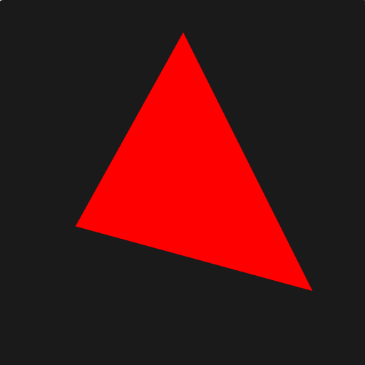

What do you see? Well, you see a triangle. So we might say that we see some graphics, a triangle to be specific.

## What is window?

Before we can draw anything, we need somewhere to draw it. A window is the rectangular area created by the OS that
our application uses to display its contents. For example, when we create a 1280×720 window, the operating system gives
our application a 1280×720 area to draw into.

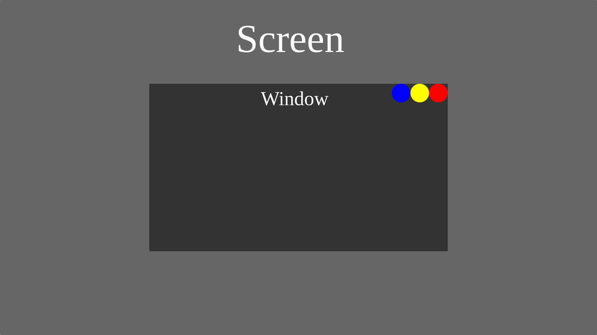

## What are Window Coordinates?

On a window the origin is (0, 0), on the top left. With x increasing from left to right and y increasing from top to bottom.

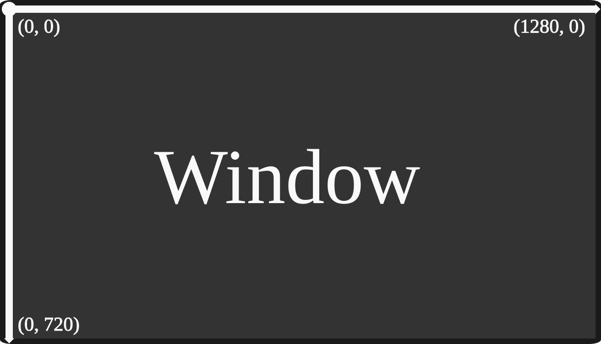

## What is a Scene?

A scene is information describing what should appear in an image. It can contain things such as the positions of objects, their colors, their shapes, their textures, lighting information, and other properties needed to describe the scene. Lets say our scene is composed of three points at three random positions. Then, let us use some magic to make a image of those three points:


Wow! So we just described a scene of three points and we got an image! Pretty neat.

## What is "Rendering?"

Rendering is the process of taking a description of a scene and producing an image from it. In the simplest possible sense, the computer determines what color each pixel should be based on the description of the scene, producing the final image that can be displayed on the screen. Lets take a look from our three points from earlier:


The process of rendering takes those points (The scene) and turn them into pixels, which might look like this:


Simarily lets take the description of a 1280x720 window and turn it all into red pixels:

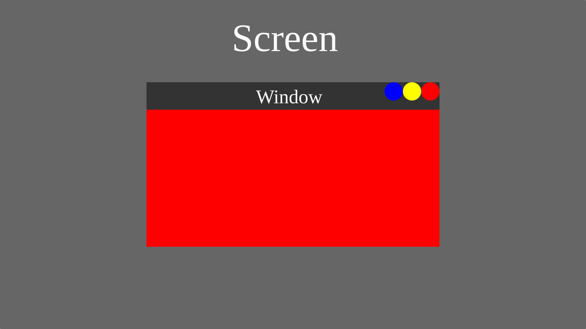

That's also rendering. So yes, clearing the screen is a form of rendering. We are taking some information, in this case "every pixel should be red," and turning that description into an image.

## The Main Loop

Before we can render anything, we need some code that repeatedly updates our application, but why repeatedly?

Because a game is constantly changing. The player might move, an enemy might attack, or an animation might advance. So a game typically does something like this over and over:

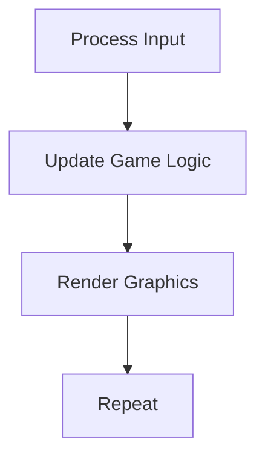

This repeating cycle is called the main loop. The exact code for a main loop depends on the platform and the libraries being used. On desktop, you might write a loop yourself. Other platforms, such as the web or mobile devices, may expect the operating system to control when your application gets to run. So before we start writing our own renderer, we need to understand how our application is actually allowed to run this loop.

### Main Loop On Desktop

On desktop platforms, your program is the boss, the OS gives your program a thread and your program takes complete control of it.

<div align="center">

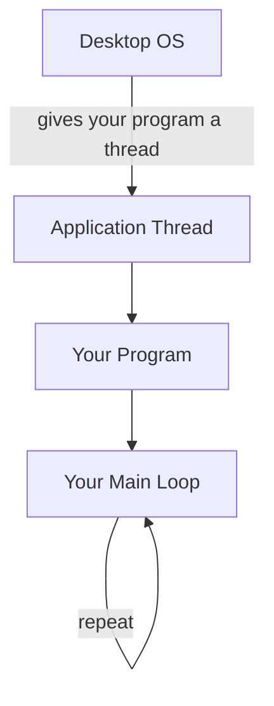

</div>

### Main Loop On Web

On the web, the story is different. A web page has an event loop that the browser uses to handle things like user input, updating the page, and drawing it. Your game normally runs on the browser's main thread alongside this event loop. So if your program creates its own infinite loop and never gives control back to the browser, the browser can't continue processing its own work. For example:

<div align="center">

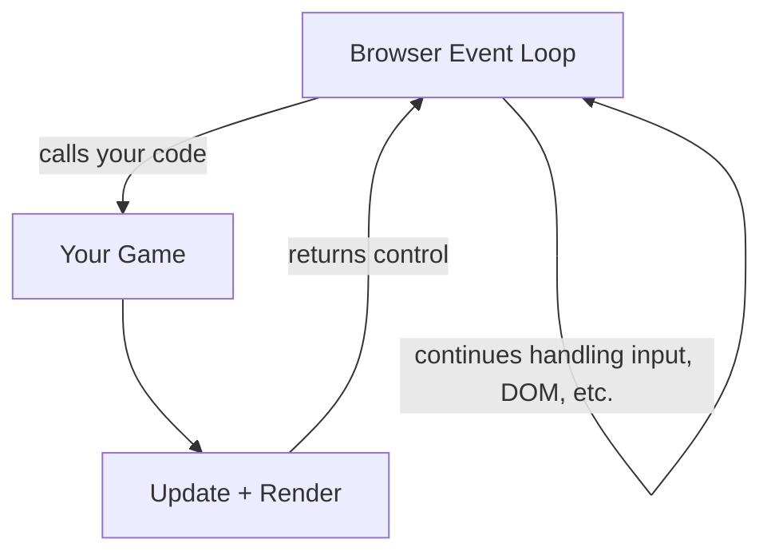

</div>

Your code gets called, does some work, and then returns control to the browser. But, if you do this:

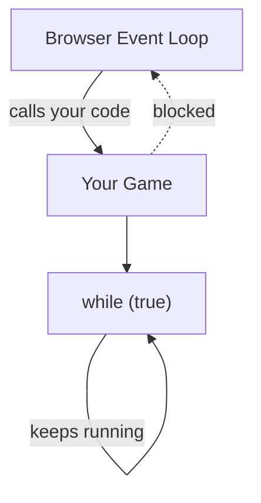

Your program never gives control back. The browser is now stuck waiting for your code to finish, which means it can't properly process input, update the page, or draw it. That's why you don't want to block the browser's main thread with your own main loop.

### Main Loop On Mobile

On mobile, the situation is similar, but instead of a browser, the **OS** manages the application's lifecycle. The OS needs to be able to tell your application things like:

> "Your application is starting."
> "Your application is being sent to the background."
> "Your application is being resumed."

Your application needs to return control to the OS so that it can process these events. If your code blocks the thread with its own endless loop, the OS can't properly deliver and process those events. So on platforms like mobile and the web, the platform has more control over the application's main loop than it does on a typical desktop application.

Lets see what happens if you don't block mobile with your own main loop:

<div align="center">

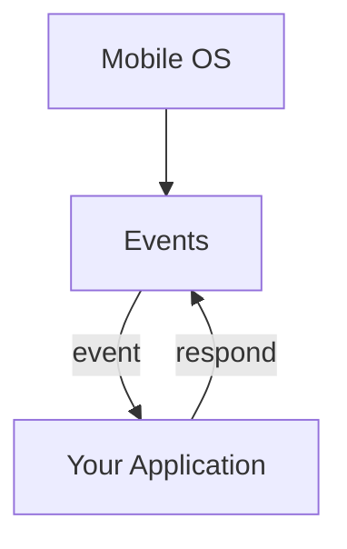

</div>

Now if you do block mobile with your own main loop:

<div align="center">

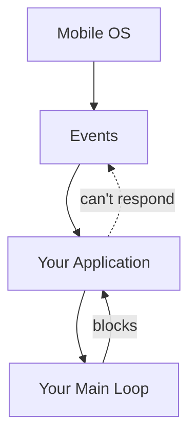

</div>

In short, while on desktop platforms you handle the main loop, on web and mobile, the browser/OS handles the main loop. You might be thinking at this point: "Damn bruh... so I have to write my code differently for each platform."

## SDL Callbacks

Worry not! As this is where "SDL callbacks" come in, by passing your code into functions like app_init, app_iterate, app_event, app_quit, SDL can use your functions and handle those platform differences for you (On desktop it constructs a main loop and calls those functions in the main loop. On mobile it calls those functions when the OS gives your program the corresponding events), allowing you to easily port your code to variety of platforms.

Lets see how to do these "SDL callbacks."

```go
package src

import "base:runtime"
import "core:c"
import sdl "vendor:sdl3"

window: ^sdl.Window

main :: proc() {
	sdl.RunApp(0, nil, app_main, nil)
}

@(export)
app_main :: proc "c" (argc: c.int, argv: [^]cstring) -> c.int {
	return sdl.EnterAppMainCallbacks(argc, argv, app_init, app_iterate, app_event, app_quit)
}

@(export)
app_init :: proc "c" (appstate: ^rawptr, argc: c.int, argv: [^]cstring) -> sdl.AppResult {
	return .CONTINUE
}

@(export)
app_iterate :: proc "c" (appstate: rawptr) -> sdl.AppResult {
	return .CONTINUE
}

@(export)
app_event :: proc "c" (appstate: rawptr, event: ^sdl.Event) -> sdl.AppResult {
	return .CONTINUE
}

@(export)
app_quit :: proc "c" (appstate: rawptr, result: sdl.AppResult) {
	context = global_context
}
```

## Creating the SDL Window

As you might realize this won't open a window by itself because there wasn't any code to explicitly create the window at all. So let us do that.

```go
package src

import "base:runtime"
import "core:c"
import sdl "vendor:sdl3"

WINDOW_WIDTH :: 1280
WINDOW_HEIGHT :: 720

global_context: runtime.Context

window: ^sdl.Window

main :: proc() {
	sdl.RunApp(0, nil, app_main, nil)
}

@(export)
app_main :: proc "c" (argc: c.int, argv: [^]cstring) -> c.int {
	context = global_context
	return sdl.EnterAppMainCallbacks(argc, argv, app_init, app_iterate, app_event, app_quit)
}

@(export)
app_init :: proc "c" (appstate: ^rawptr, argc: c.int, argv: [^]cstring) -> sdl.AppResult {
	context = global_context
	ok := sdl.Init({.VIDEO})
	assert(ok)

	window = sdl.CreateWindow("Handmade GPUer", WINDOW_WIDTH, WINDOW_HEIGHT, {})
	assert(window != nil)

	return .CONTINUE
}

@(export)
app_iterate :: proc "c" (appstate: rawptr) -> sdl.AppResult {
	context = global_context
	return .CONTINUE
}

@(export)
app_event :: proc "c" (appstate: rawptr, event: ^sdl.Event) -> sdl.AppResult {
	context = global_context
	#partial switch event.type {
	case .QUIT:
		return .SUCCESS
	}
	return .CONTINUE
}

@(export)
app_quit :: proc "c" (appstate: rawptr, result: sdl.AppResult) {
	context = global_context
	sdl.DestroyWindow(window)
	sdl.Quit()
}
```

Now if you run the code above you will see a majestic empty window pop up on your screen.........

HAHAHA I lied! That code does not open a window... well I only partially lied, it does open a window, but you don't see it. That is because we haven't drawn anything to the window so the window has nothing to "present" to us. Lets try and clear the window... which is well... the whole point of this chapter.

## How does the GPU draw?

Before we can tell the GPU to clear the window, we need to understand
some of the machinery involved in getting commands from our program to the
GPU.

### What is a GPU API?

Before we can talk about GPU devices and drivers, we need to understand the thing our program is actually programming against. Basically, OpenGL, Vulkan, and DirectX 11 are GPU APIs. An API is a set of functions, types, and rules that define how your program can interact with something. For example, an API might define a function for creating a texture and specify what arguments that function takes, what it does, and what it returns. A GPU API therefore defines how a program can communicate with a GPU.

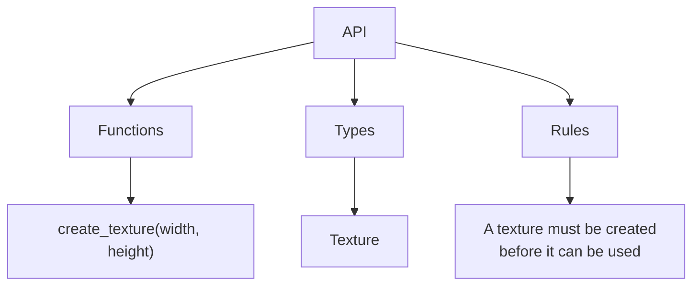

### GPU Driver

So we have an API that defines a bunch of commands and rules. But who actually makes those commands work on our particular GPU? That's the job of the GPU driver. A GPU driver is the implementation of a GPU API for a particular GPU. So you can think of it like this:

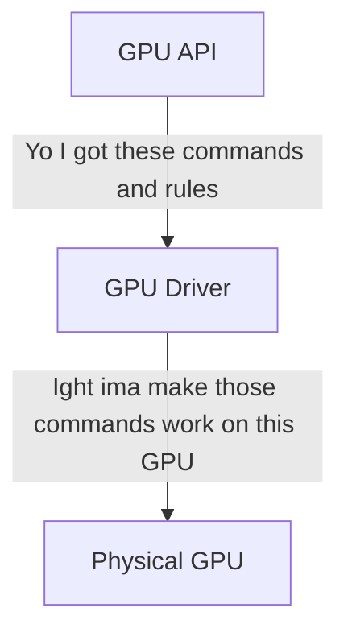

For example, AMD can provide a driver that implements a graphics API for AMD GPUs, while NVIDIA can provide its own implementation for NVIDIA GPUs. This is why the same graphics API can work on different GPUs. The API defines the interface, while the driver provides the implementation for the hardware.

### API Loader

Okay, so now we have our API and we have a driver that implements that API. But there's still a problem. How does a program actually find and load that implementation? This is where an API loader comes in. An API loader is a piece of software that helps a program find and access an implementation of an API. The API loader then gives us function pointers to the implementations we want. However, we don't use API loaders directly anymore like in the old days, we have to go one layer deeper into what is called the GPU device.

### What is a GPU Device?

The GPU device is an abstraction that internally uses API loaders to load the driver implementations that are availible for you, so that you don't have to use a bunch of function pointers that the loaders give you, you use the functions of the GPU device abstraction provides.

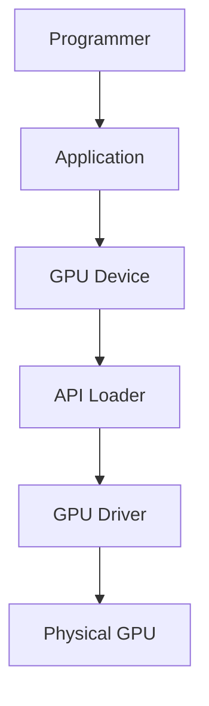

### What is a Color Target (Aliases: Color Attachment, Render Target, RTV)?

Now we can start talking about where the GPU actually puts the graphics it produces. A color target is an image that the GPU writes pixel colors into while rendering.

### Load Operations

A load operation tells the GPU what to do with the existing contents of an image when rendering begins. For example, LOAD means keep what is already in the image, while CLEAR means replace the existing contents with a specified color.

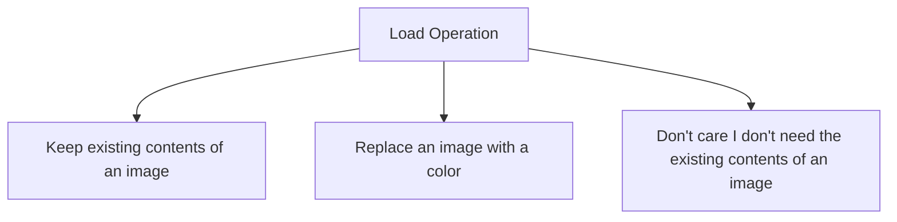

### Store Operations

A store operation tells the GPU what to do with the image after rendering finishes. STORE means keep the resulting image, while DONT_CARE means we no longer need the image, so its contents can be discarded.

### What is a Swapchain?

The idea of a swapchain is that you have a image that you render to and an image that you display then after a frame is finished those two images swap roles. Below is a visual demonstration of what a swapchain is.

<figure>
  
  <figcaption>I stole this straight from https://gpuforbeginners.com/ go check out their tutorial it is pretty cool also.</figcaption>
</figure>

The reason we do this is because if we don't the user will see screen tearing because the GPU is updating display memory while the monitor is reading it.


### What is a Command Buffer?

A command buffer is a list of instructions that gets sent to the GPU.

<div align = "center">

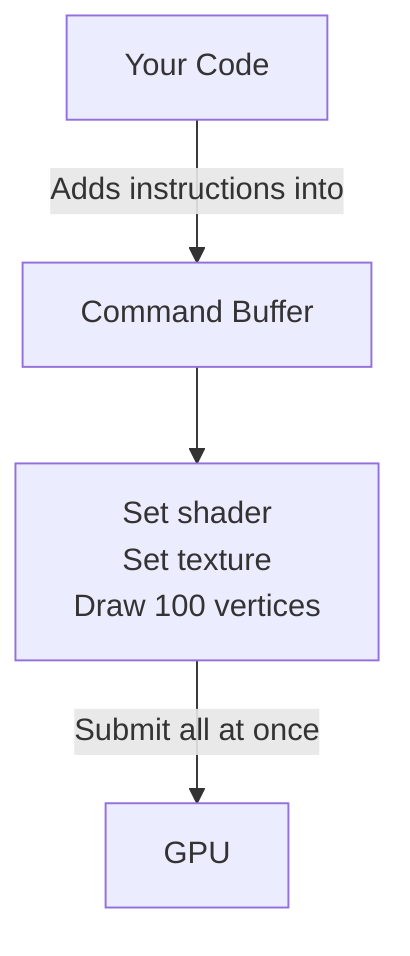

</div>

#### Why does a Command Buffer Exist?

Without a command buffer, the CPU would have to send commands one by one to the GPU, and the CPU would have to wait for the GPU after every command:

<div style="
max-width: 650px;
margin: 2em auto;
padding: 1.5em 2em;
border-radius: 12px;
background: var(--md-code-bg-color);
font-family: monospace;
line-height: 1.8;
">
<div style="text-align: center; font-size: 1.2em; font-weight: bold; margin-bottom: 1em;">
The Story of the Command Buffer
</div>
<div><b>CPU:</b> Do this bro.</div>
<div><b>GPU:</b> I gotchu bro.</div>
<div style="opacity: 0.55; padding: 0.5em 0;">
CPU is waiting...
</div>
<div><b>GPU:</b> Bro, im done.</div>
<div><b>CPU:</b> Bro, do this now.</div>
<div><b>GPU:</b> Ok bro.</div>
<div style="opacity: 0.55; padding: 0.5em 0;">
CPU is waiting...
</div>
<div><b>CPU:</b> You done bro?</div>
<div style="opacity: 0.55; padding: 0.5em 0;">
GPU is still working...
</div>
<div><b>CPU:</b> Bro, why do you gotta be so slow?</div>
<div><b>GPU:</b> BRO, WHY CAN'T YOU SEND ME THE INSTRUCTIONS ALL AT ONCE SO I DON'T HAVE TO KEEP GOING BACK TO YOU?</div>
<div><b>CPU:</b> Bro... the reason is because my programmer is stupid! Hes programming me to send you the instructions one by one!</div>
<div><b>Programmer:</b> Bro.... I heard that... you know what you right, ima invent something called the command buffer.</div>
</div>

### What is a Render Pass?

A render pass is a section where you tell the GPU the color targets you are going to render to. You can think of it like a container.
<div style="
    max-width: 600px;
    margin: 2em auto;
    padding: 1.5em;
    border: 2px solid var(--md-default-fg-color--light);
    border-radius: 8px;
    background: var(--md-code-bg-color);
    font-family: monospace;
">

<div style="
    padding-bottom: 1em;
    text-align: center;
    font-size: 1.3em;
    font-weight: bold;
">
    Render Pass
</div>

<div style="
    padding: 1em;
    border: 2px dashed var(--md-default-fg-color--light);
    border-radius: 6px;
">

<div><b>Color Target:</b> Screen</div>

<div style="margin-top: 1em;">
    <b>Load:</b> CLEAR
</div>

<div style="margin-top: 1em;">
    <b>Command Buffer:</b><br>
    &nbsp;&nbsp;Add draw triangle command<br>
    &nbsp;&nbsp;Add draw sprites command<br>
    &nbsp;&nbsp;Add draw UI command
</div>

<div style="margin-top: 1em;">
    <b>Store:</b> YES
</div>

</div>
</div>

Now lets see how to clear the background. If you understand the concepts, you should be able to read most of this code like English. Focus most of your attention to app_init and app_iterate.

```go title="main.odin"
--8<-- "the_window/src/main.odin"
```

Congratulations! You have now rendered a dark blue background!


