# The Triangle

Now we got our window up and running, its finally time to render a triangle! However, before then you must understand the graphics pipeline.

## The Graphics Pipeline

First, what even is a pipeline or rather what does a pipeline even do? Well, a pipeline takes a input and through a series of transformations creates a output.

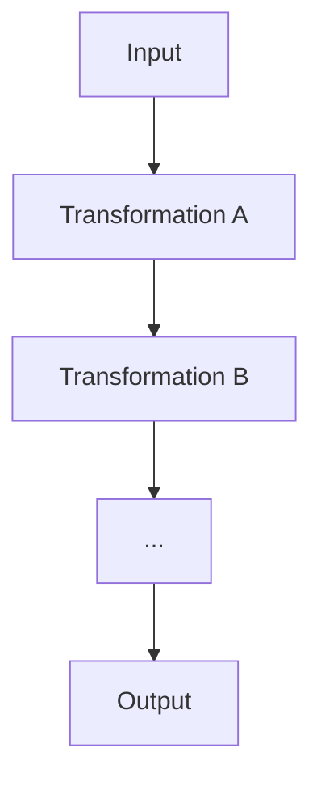

Transformation A takes in input and then spits out something to send to transformation B. Transformation B takes in the output from Transformation A and spits out something to send to transformation C, and so on. In the case of the graphics pipeline, it takes in vertices then spits out pixels:

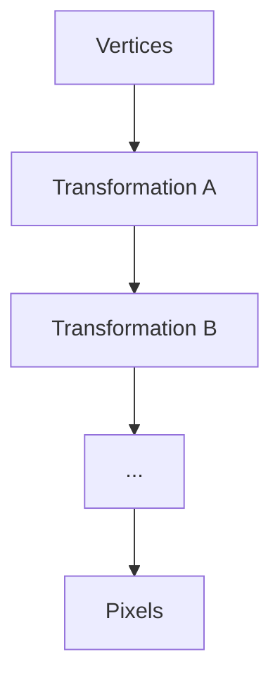

Now the terms "transformation a" and "transformation b" seem a little abstract, lets actually define what these transformations are:

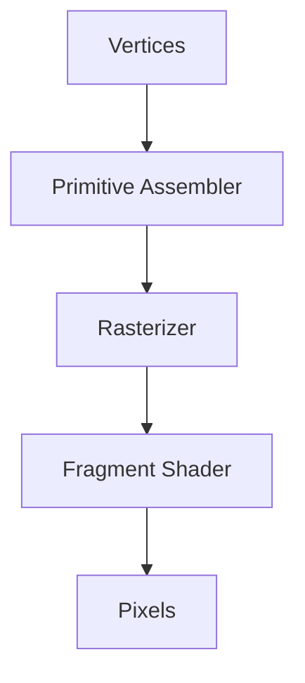

This may seem like a bunch of random jargon, but lets break this down.

### What Exactly Is A Vertex?

In graphics programming, a vertex is simply data, in most scenarios it may contain position:

```go
Vertex :: struct {
    position: [3]f32,
}
```
Visually if you place three vertices randomly on a window you might see something like:

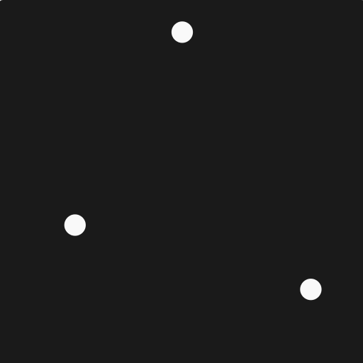

### What Exactly Is A Primitive Assembler

A primitive assembler takes the three points and connects those three points to create a triangle.

## Vertex Shader

A vertex shader is a program that runs on the GPU for every vertex you give it. From that phrase alone, the concept of a vertex shader may seem a little abstract, so lets imagine a triangle ABC centered at the origin of the window:

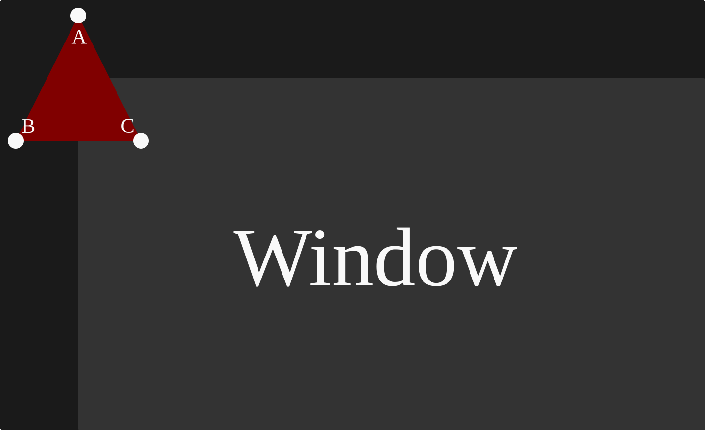

Mentioned again, the vertex shader runs every for each of these vertices.

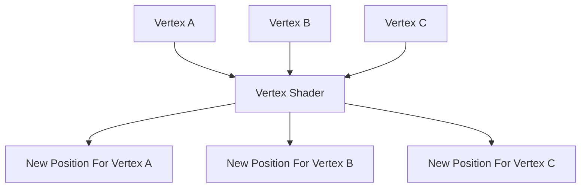

Now after running through the vertex shader, we see that the triangle is now centered on the window.

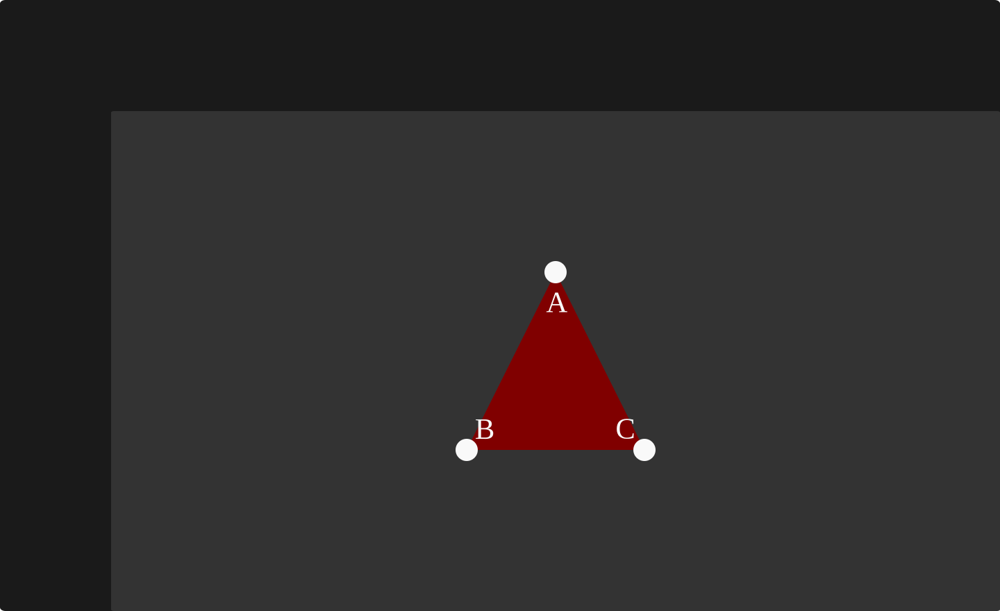

Of course you don't necessarily have to center the triangle you could move it anywhere you want.

## Rasterization

Rasterization is the process of converting a mathematical triangle into fragments. Wait, the hell does that definition even mean? Well lets slow down for a second.

Remember that your screen is made up of pixels:
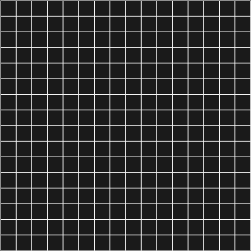

Now lets put points on this screen representing a triangle.

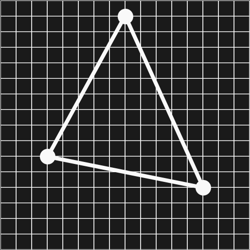

Now let the rasterizer do its job.

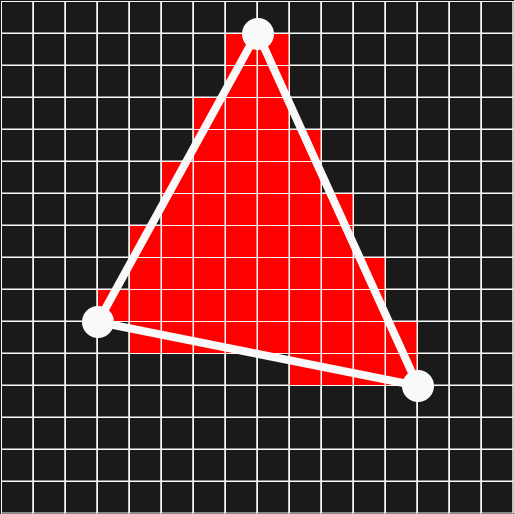

So what did the rasterizer just do here? Well the rasterizer produced **fragments** inside the points defining a triangle. Wait... what do I mean by fragments? Aren't those pixels?

## Fragments

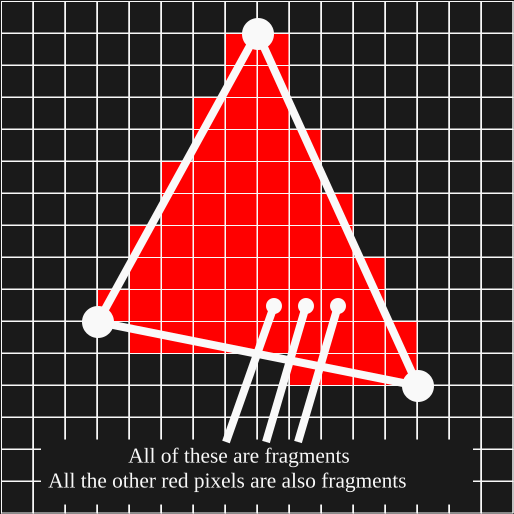

Fragments are not pixels. They are **potential pixels**.

What do I mean by potential pixels? Well, you must understand that a fragment is **not guaranteed to appear in the final image**. After rasterization, multiple fragments can correspond to the same pixel. For example, if two triangles overlap, both triangles can produce a fragment for the same location, but only the fragment from the triangle in front may end up contributing to the final pixel. Since these results are only potential contributions to the final image, we call them **fragments** rather than pixels.

## Fragment Shader

We now have a bunch of fragments generated by rasterizing our triangle. But these fragments don't have a color yet. This is where the fragment shader comes in. A fragment shader is a program that runs on the GPU for every fragment produced by rasterization. A fragment shader's job is to determine what color each fragment should have.

So lets run the triangle previous triangle through a fragment shader to see what we get:

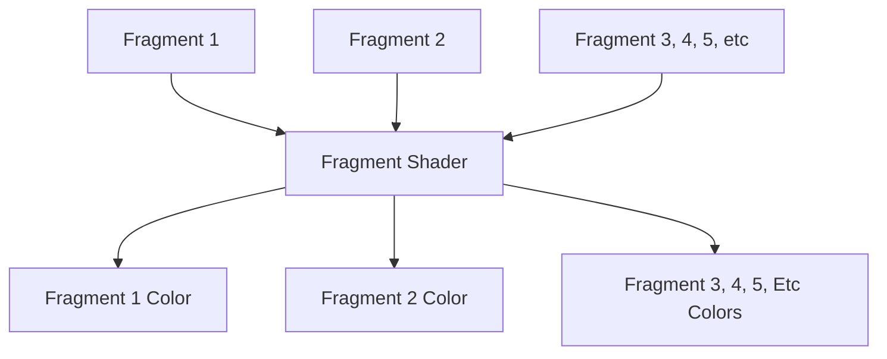

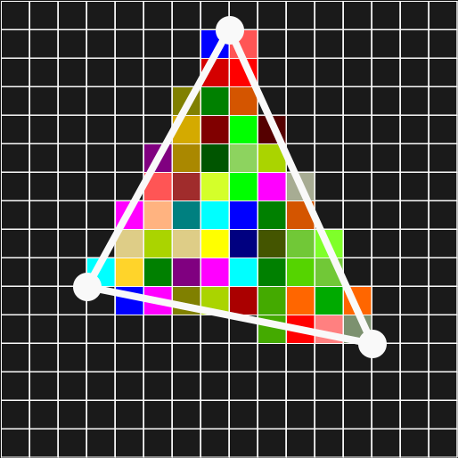

## Graphics Pipeline

A graphics pipeline is a collection of settings and shaders that tells the GPU how to turn vertices into pixels. You feed it vertices and it sends those vertices through a pipeline:

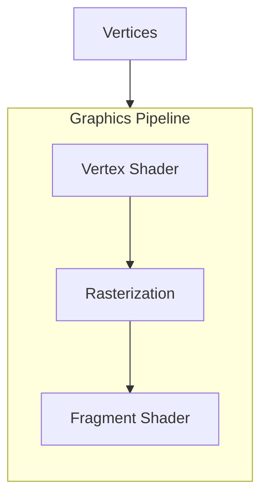

Later on, there will be more stages to this graphics pipeline, but this is it so far for our use case.

## Writing Our Shaders

Im getting pumped up, lets actually program the GPU and write some vertex and fragments shaders. But first... we gotta learn about the language we are going to use to program these vertex and fragment shaders.

### HLSL

HLSL (High Level Shading Language) is a shading language used to written shaders for graphics APIs like DirectX. It looks somewhat like C because its syntax is similar, but it has special types and features for graphics programming. I welcome you to a short HLSL crash course!

#### HLSL Crash Course: Semantics

What are semantics in HLSL? To explain that lets look at a variable in HLSL.

```
float4 position: SV_Position;
```

So here we have a position variable. In HLSL this position variable has a type of float4 and SV_Position is the semantic (Semantic = meaning). SV_Position tells the GPU that the position variable is meant as a position variable. However, you might have already noticed that it is prefixed with SV_, what is up with that prefix? A semantic prefixed with SV_ tells us that it is a System-Value semantic. When a variable has a System-Value semantic, it tells us that it has a special meaning to the graphics pipeline and are interpreted by the GPU. Semantics that are not prefixed by SV_ do not have a special meaning to the GPU. You could even use your own non System-Value semantics. So you could do something like this:

```
float3 me: HandmadeGPUer
```

That semantic is called a user-defined semantic.

#### HLSL Crash Course: VSOutput (Vertex Shader Output)

VSOutput is a struct defining the data that the vertex shader will pass to the next stage of the graphics pipeline. In here lets put in the vertex positions.

```hlsl
struct VSOutput
{
    float4 position : SV_Position;
};
```

That VS Output will then be sent to the next stage in the pipeline, which is the rasterization stage.

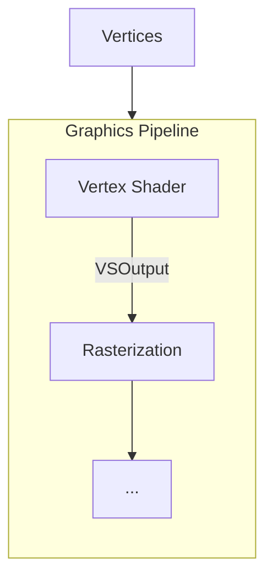

### The Vertex Shader

Lets start writing the vertex shader now. Lets define the variables we are going to send to the next phase of the pipeline: the rasterizer.

```hlsl
struct VSOutput
{
    float4 position : SV_Position;
    float4 color    : COLOR;
};
```

During rasterization, the GPU takes the vertex shader's outputs and **interpolates the variables with user-defined semantics across the triangle**. For example, if each vertex has a different color variable with semantic `COLOR`, the GPU interpolates those colors to determine a color for each fragment:

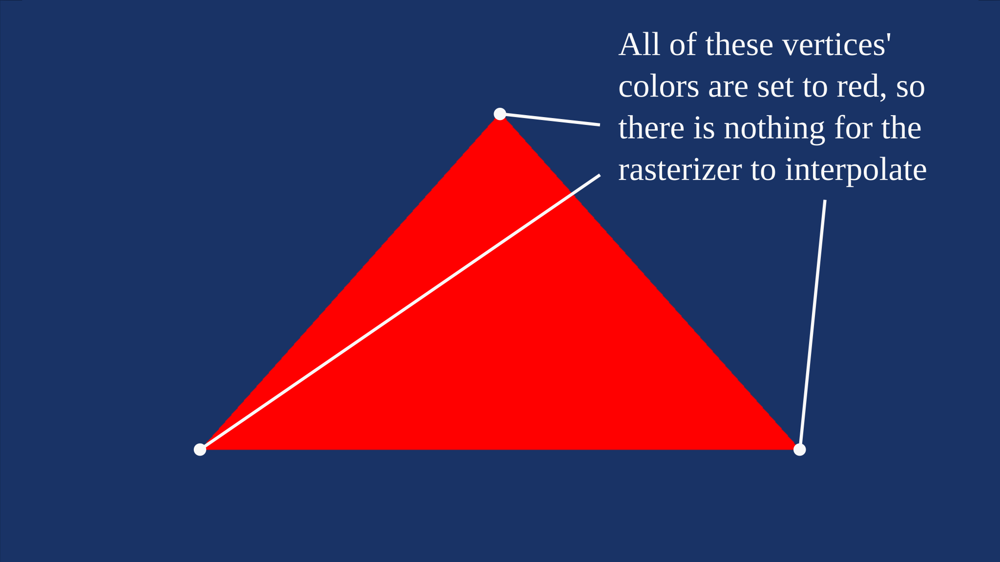
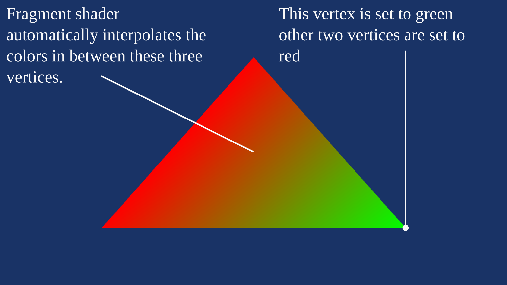

The fragment shader then receives these interpolated values and can use them to determine the fragment's final color. It might simply return the interpolated color, or it could use that color to calculate something different, such as making it darker or lighter. For our current VSOutput this is how it looks when it gets sent to the fragment shader:

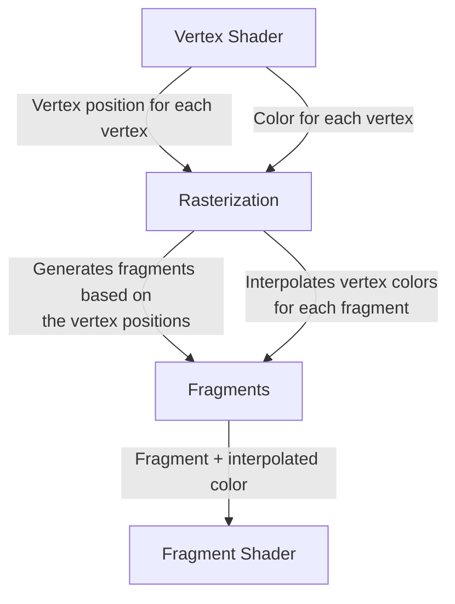

Anyways lets now write the main function:

```hlsl
VSOutput main(uint vertexID : SV_VertexID)
{
    VSOutput output;

    float2 positions[3] =
    {
        float2( 0.0,  0.6),
        float2( 0.6, -0.6),
        float2(-0.6, -0.6)
    };

    float4 colors[3] =
    {
        float4(1.0, 0.0, 0.0, 1.0),
        float4(0.0, 1.0, 0.0, 1.0),
        float4(0.0, 0.0, 1.0, 1.0)
    };

    output.position = float4(positions[vertexID], 0.0, 1.0);
    output.color = colors[vertexID];

    return output;
}
```

You might be wondering why our positions are first float2 then converted to float4. The positions in our positions array only contain the x and y coordinates of our 2D triangle, so we use float2. However, SV_Position expects a four-component position containing x, y, z, and w. That's why we take our float2 position and turn it into a float4 by adding z = 0.0 and w = 1.0. Do not worry about what w is currently I will get to that in a later chapter.

## Fragment Shader

We have the vertex shader thats going to pass the vertex positions and vertex colors to the rasterizer and that rasterizer is going to send the fragment shader the fragments and their interpolated colors. Lets just take the interpolated colors from the rasterizer for what it is and return it.

```hlsl
float4 main(float4 color : COLOR) : SV_Target0
{
    return color;
}
```

## Compiling Our Shaders

Congratulation! You now have a rainbow triangle!

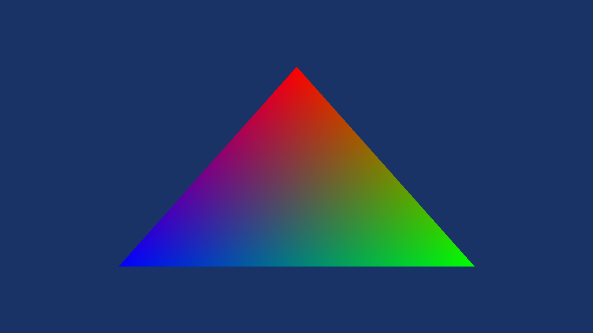
