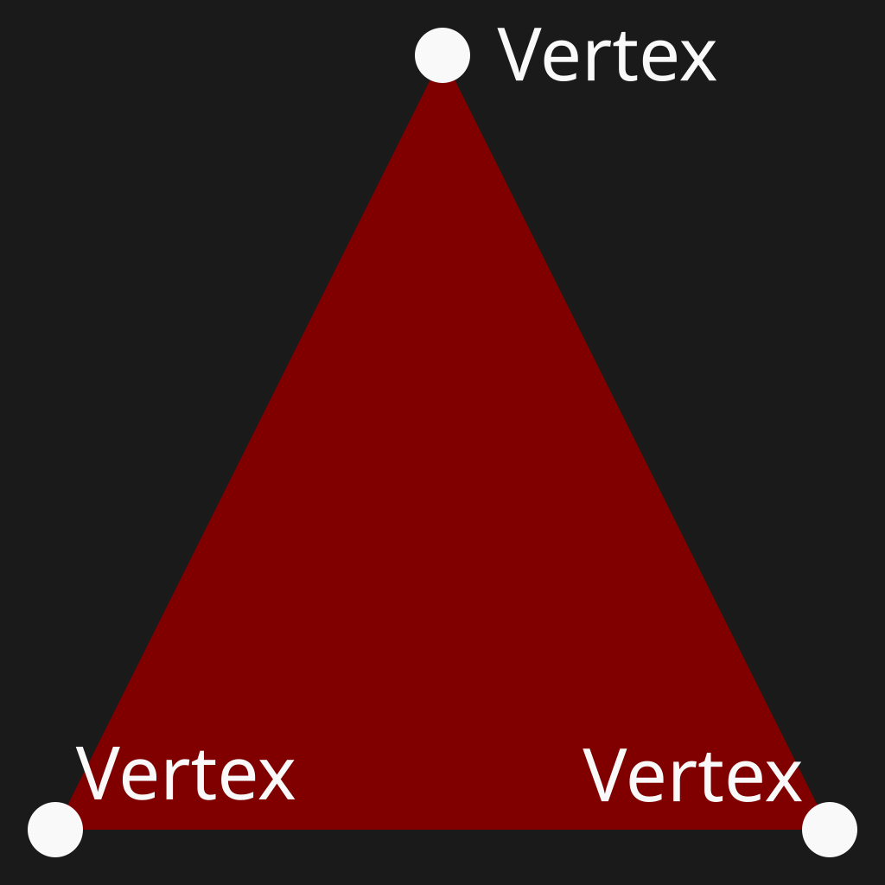
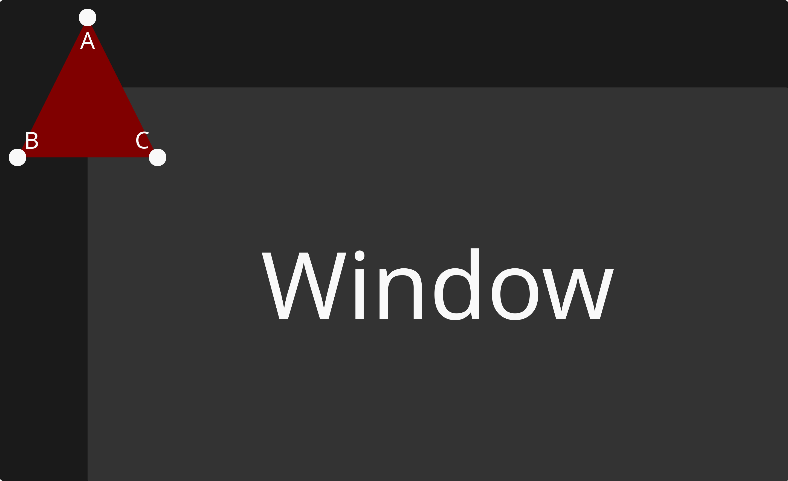
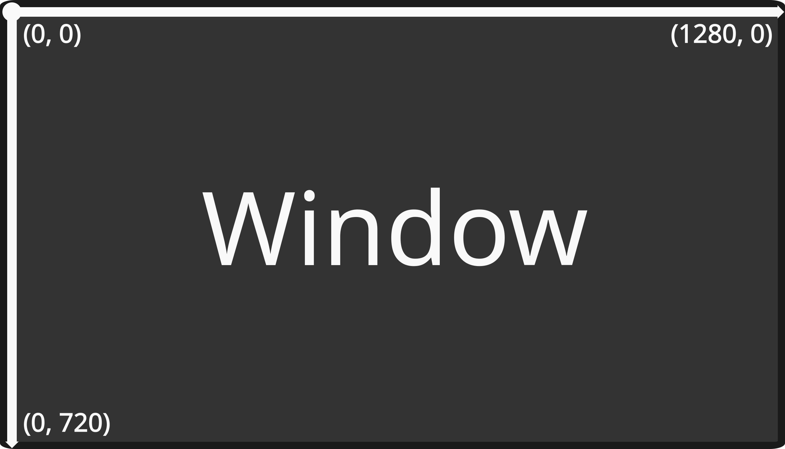
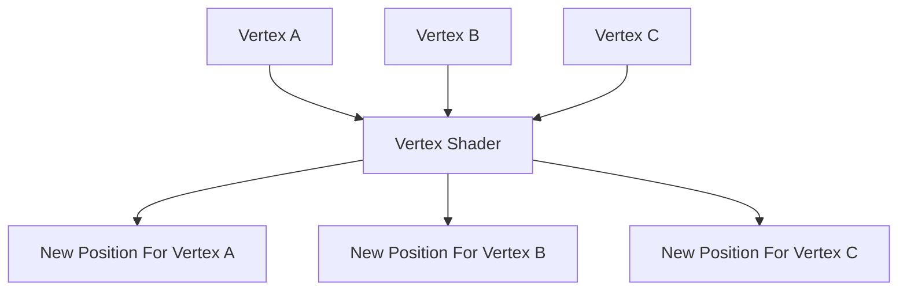
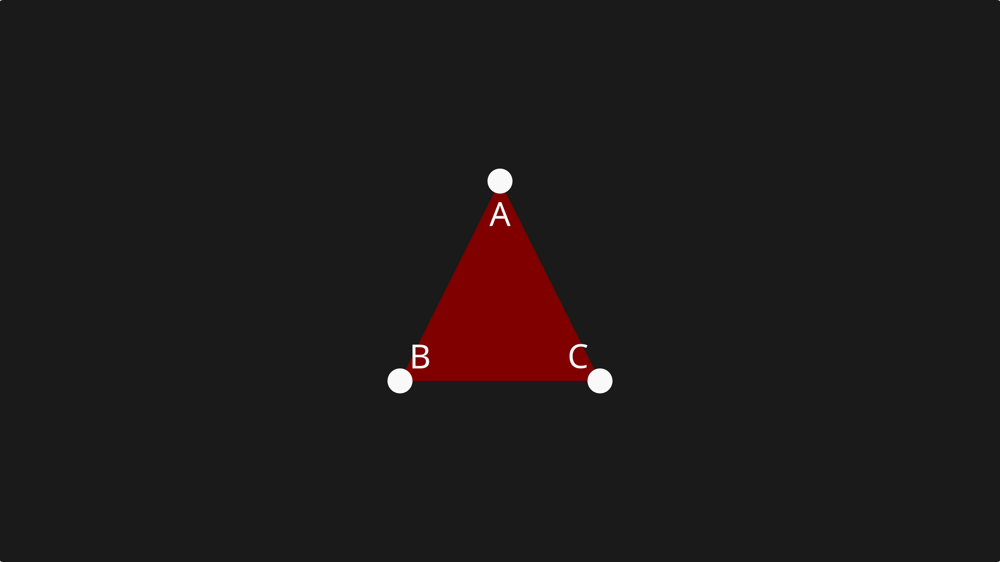
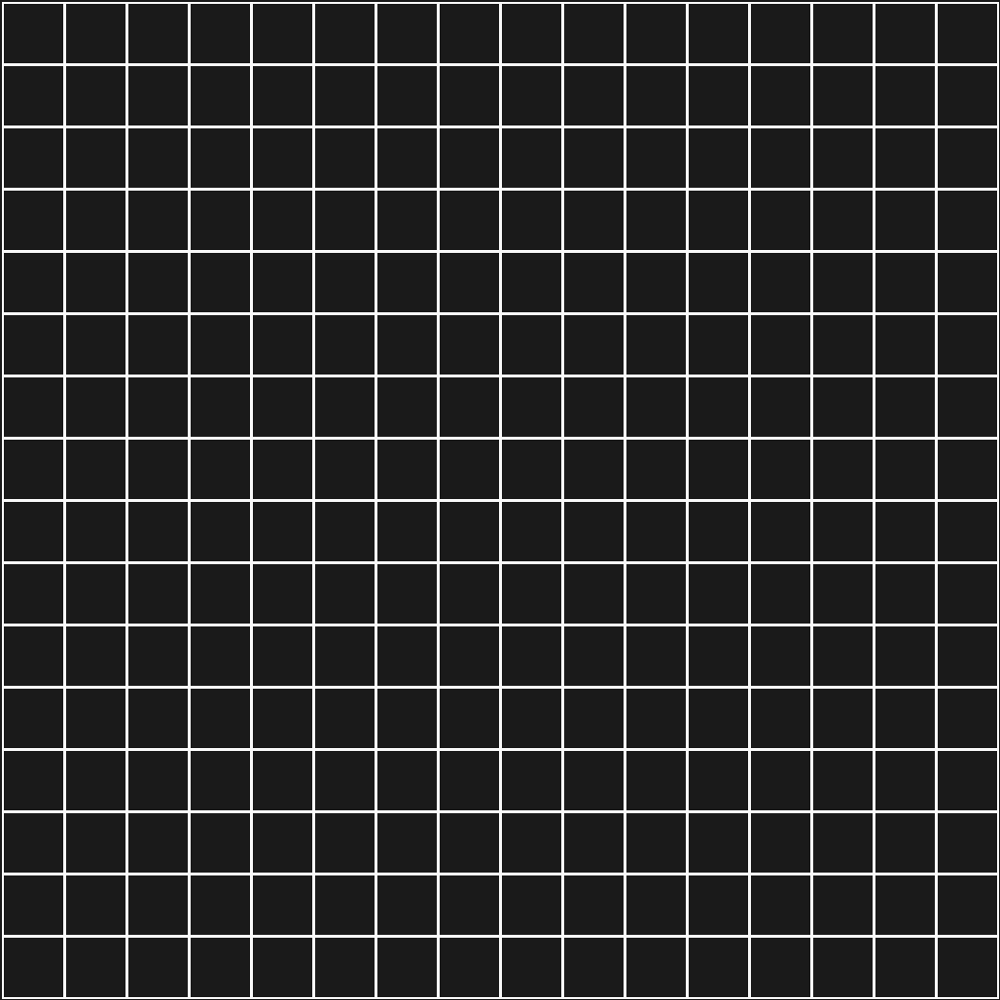
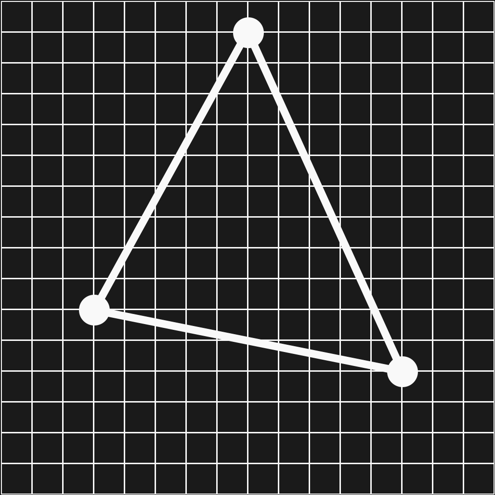
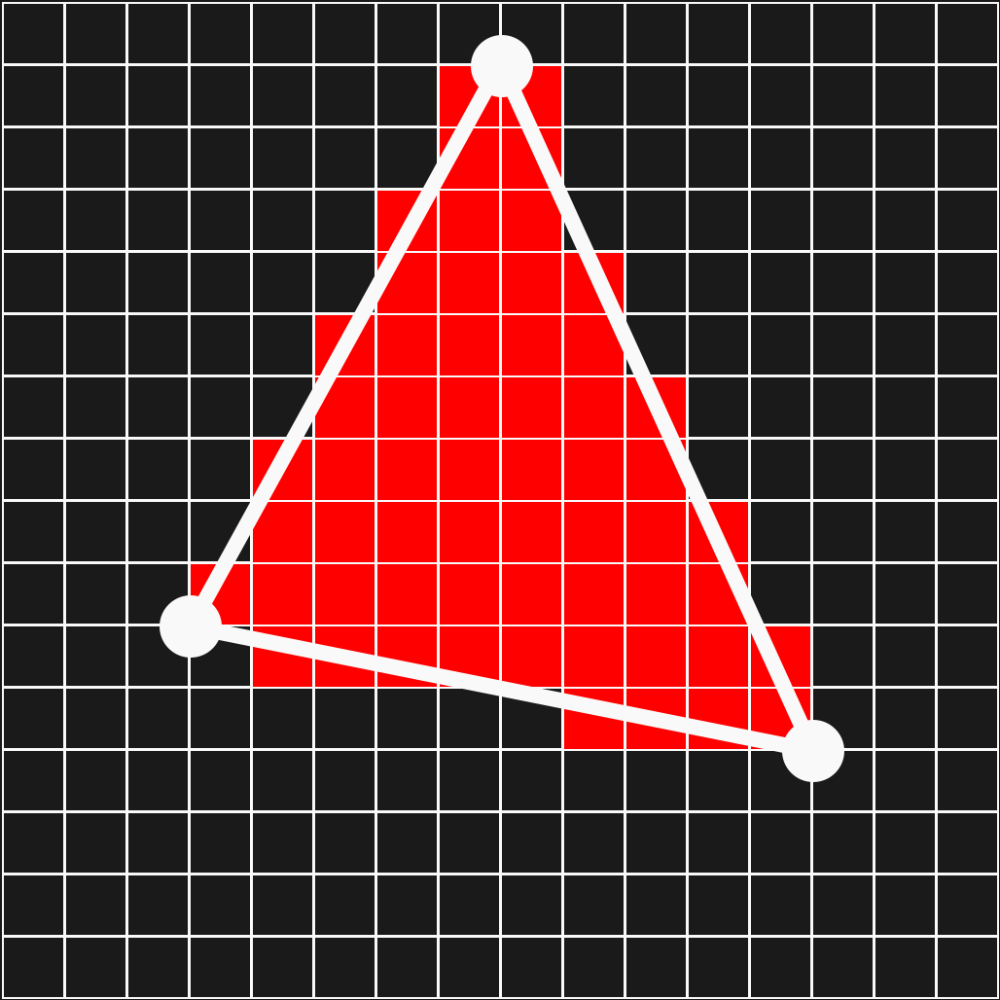

# The Triangle

Now we got our window up and running, its finally time to render a triangle! Before then you must understand a few concepts.

## Vertex

A vertex is simply a point. In the triangle below, it has three vertices.



## Vertex Shader

A vertex shader is a program that runs on the GPU for ever vertex you give it. From that phrase alone, the concept of a vertex shader may seem a little abstract, so lets imagine a triangle ABC at the centered at the origin of the window:



??? note "Wait how is that the origin of the window?"
    This is called screen coordinates the origin is the top left of the window and X increases as you move right and Y increases as you move down.
    

Mentioned again, the vertex shader runs every for each of these vertices.



Now after running through the vertex shader, we see that the triangle is now centered on the window.



Of course you don't necessarily have to center the triangle you could move it anywhere you want.

## Rasterization

Rasterization is the process of converting a mathematical triangle into fragments... wait a second... the hell is a fragment? Well lets slow down for a second.

Remember that your screen is made up of pixels:


Now lets put points on this screen representing a triangle.



Now you fill in the triangle with pixels.



That is rasterization. It produces fragments. Huh? Wait a second... what is a fragment? Well, a fragment is a potential pixel generated when the GPU rasterizes the triangle produced by the vertex shader.

<details>
<summary>What do you mean potential pixel?</summary>

A fragment isn't guaranteed to become a pixel in the final image. Imagine if there are two triangles overlapping, both triangles are rasterized but one triangle is in front of the other and some fragments of one triangle cannot be shown.

</details>

Congratulation! You now have a rainbow triangle!


```

```
