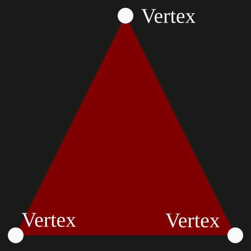
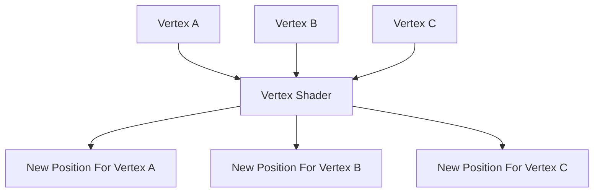
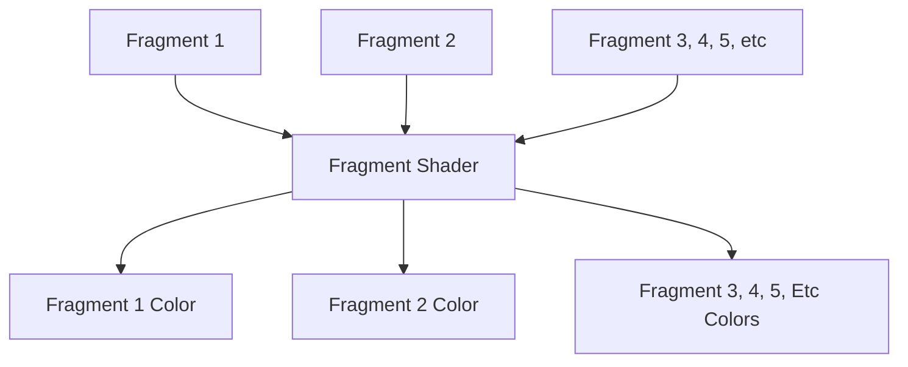
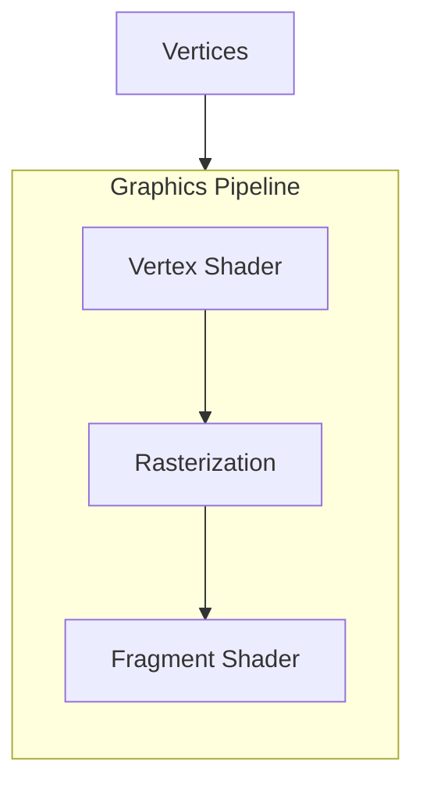
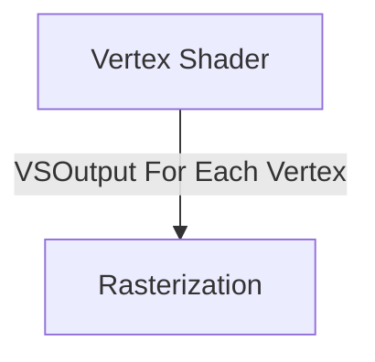
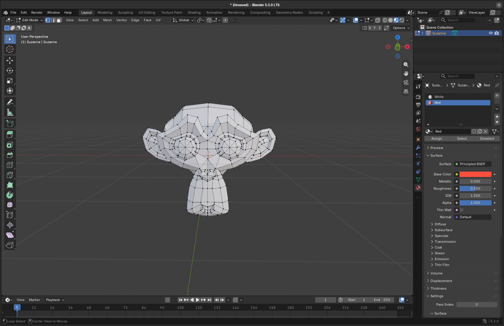
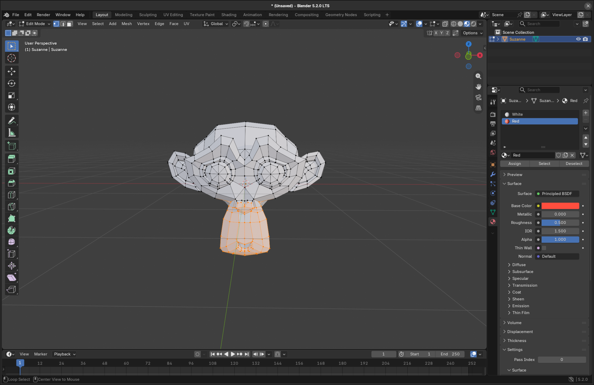
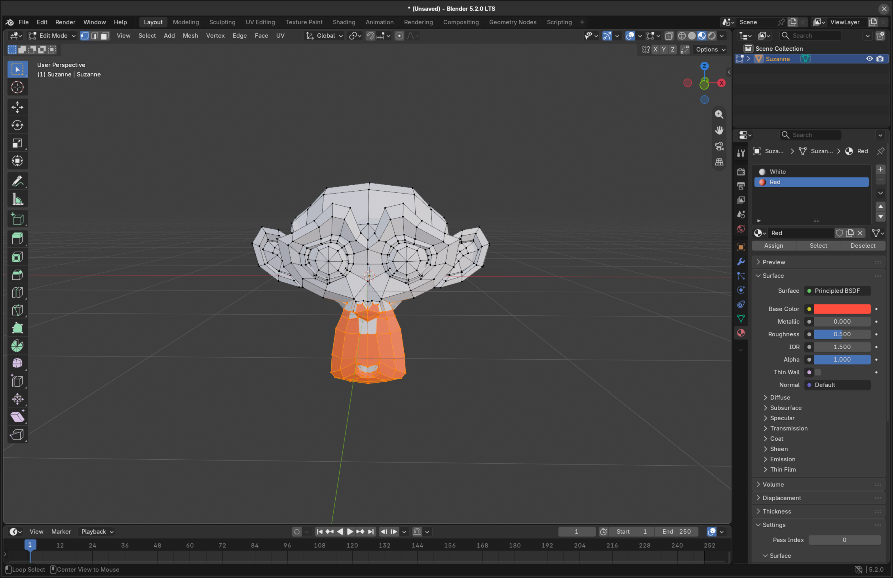
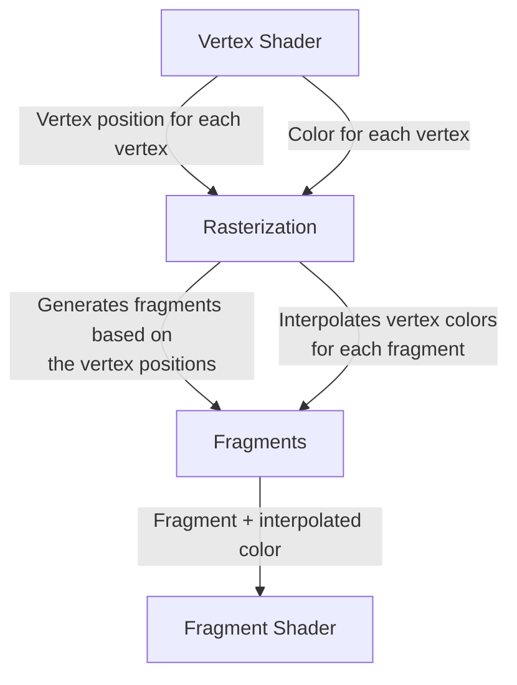

# The Triangle

Now we got our window up and running, its finally time to render a triangle! Before then you must understand a few concepts.

## Vertex

A vertex is simply a point. In the triangle below, it has three vertices.



## Vertex Shader

A vertex shader is a program that runs on the GPU for ever vertex you give it. From that phrase alone, the concept of a vertex shader may seem a little abstract, so lets imagine a triangle ABC at the centered at the origin of the window:


Mentioned again, the vertex shader runs every for each of these vertices.



Now after running through the vertex shader, we see that the triangle is now centered on the window.


Of course you don't necessarily have to center the triangle you could move it anywhere you want.

## Rasterization

Rasterization is the process of converting a mathematical triangle into fragments. Wait, the hell does that definition even mean? Well lets slow down for a second.

Remember that your screen is made up of pixels:


Now lets put points on this screen representing a triangle.


Now let the rasterizer do its job.


So what did the rasterizer just do here? Well the rasterizer produced **fragments** inside the points defining a triangle. Wait... what do I mean by fragments? Aren't those pixels?

## Fragments


Fragments are not pixels. They are **potential pixels**.

What do I mean by potential pixels? Well, you must understand that a fragment is **not guaranteed to appear in the final image**. After rasterization, multiple fragments can correspond to the same pixel. For example, if two triangles overlap, both triangles can produce a fragment for the same location, but only the fragment from the triangle in front may end up contributing to the final pixel.

Because these results are only potential contributions to the final image, we call them **fragments** rather than pixels.


## Fragment Shader

We now have a bunch of fragments generated by rasterizing our triangle. But these fragments don't have a color yet. This is where the fragment shader comes in. A fragment shader is a program that runs on the GPU for every fragment produced by rasterization. A fragment shader's job is to determine what color each fragment should have.

So lets run the triangle previous triangle through a fragment shader to see what we get: 




## Graphics Pipeline

A graphics pipeline is a collection of settings and shaders that tells the GPU how to turn vertices into pixels. You feed it vertices and it sends those vertices through a pipeline:



Later on, there will be more stages to this graphics pipeline, but this is it so far for our use case.

## Writing Our Shaders

Im getting pumped up, lets actually program the GPU and write some vertex and fragments shaders. But first... we gotta learn about the language we are going to use to program these vertex and fragment shaders. 

### HLSL

HLSL (High Level Shading Language) is a shading language used to written shaders for graphics APIs like DirectX. It looks somewhat like C because its syntax is similar, but it has special types and features for graphics programming. Well enough is enough, lets learn how to program in it.


#### HLSL Step 1: Semantics

What are semantics in HLSL? To explain that lets look at a variable in HLSL.

```
float4 position: SV_Position;
```

So here we have a position that is of type float4 and then huh? Wait what? SV_Position... does that mean that position is of type float4 and SV_Position? The answer is no, float4 is the type and SV_Position is the semantic (Semantic = meaning). SV_Position tells the GPU that the position variable is meant as a position variable. Lets look at a different variable:

```
float4 color: TEXCOORD0
```

So at this point, you might be asking: "Why did we define this color variable with TEXCOORD0, is there no semantic specifically for colors?" The answer to that question is "Yes! There is no semantic specifically for colors!" 

Lets refer back to the semantic `SV_Position`. You might have already noticed that it is prefixed with SV_. SV tells us that it is a System-Value semantic. When a variable has a System-Value semantic, it tells us that it has a special meaning to the graphics pipeline and are interpreted by the GPU. Semantics that are not prefixed by SV_ do not have a special meaning to the GPU. So really, color can be marked with any semantic that doesn't have a SV_ prefix. 

#### HLSL Step 2: Defining VSOutput (Vertex Shader Output)

VSOutput is a struct defining the data that the vertex shader will pass to the next stage of the graphics pipeline. In here lets put in the vertex positions and colors.

```hlsl
struct VSOutput
{
    float4 position : SV_Position;
    float4 color    : TEXCOORD0;
};
```

That VS Output will then be sent to the next stage in the pipeline, which is the rasterization stage.



### The Vertex Shader

Lets start writing the vertex shader now. Lets define the variables we are going to send to the next phase of the pipeline: the rasterizer.

```hlsl
struct VSOutput
{
    float4 position : SV_Position;
    float4 color    : TEXCOORD0;
};
```

Woah... wait a second... why is the vertex shader storing colors? Didn't I say colors had something to do with fragment shaders or the other way around: fragment shaders had something to do with colors? To answer this, you first have to understand something: **the vertex shader doesn't decide the final colors of the fragments**, but it does decide the initial colors of the fragments.

Lets step aside for a moment, I want you to meet Blender: A 3D modeling software (Many of you will already know what Blender is).


Then I want you to meet Suzanne, a monkey 3D model:



Lets now select some of Suzanne's vertices:



Lets now assign the color red to the selected vertices of Suzanne:



The key here is that we assigned the colors to the vertices of Suzanne. We didn't assign colors to the individual fragments of Suzanne. That would be tedious and would require storing color data for every fragment. Instead, we assign data to each vertex. During rasterization, the GPU takes the vertex shader's outputs and **interpolates the variables with non-system-value semantics across the triangle**. For example, if each vertex has a different color, the GPU interpolates those colors to determine a color for each fragment. The fragment shader then receives these interpolated values and can use them to determine the fragment's final color. It might simply return the interpolated color, or it could use that color to calculate something different, such as making it darker or lighter.

For our current VSOutput this is how it looks when it gets sent to the fragment shader.


Congratulation! You now have a rainbow triangle! 


